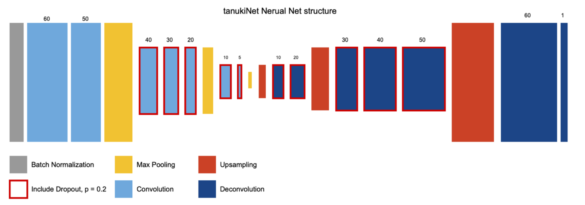

# tanukiNet v1

### Abstact
- Deconvolutional 구조를 가지는 Lane detection algorithm
- [CULane Dataset](https://xingangpan.github.io/projects/CULane.html)중, driver_182.zip을 train data로써 활용
- tanukiNetv1.json = 모델 구조 파일, tanukiNetv1.h5 = Weights of Model
- make_pickle_for_train.py -> 데이터 이미지의 해상도를 1/6로 낮추어 Pickle 파일로 통합 (다루기 쉽도록)
- make_labels_strong.py -> 주어진 CUlane의 경우, 인식된 부분이 255가 아니라 1,2,3등으로 표기되어 있어 255로 변경
- timed_pickle_baker.py -> LSTM 버전을 위한 학습 데이터 생성기. 

### Neural Net Structure

- Deconvolutional 구조
- 일반 Segmentation과는 달리 Core layer에 가까워질수록, 필터 수가 적어지는 구조